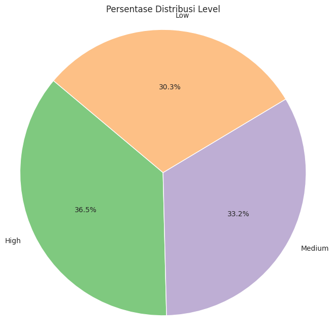
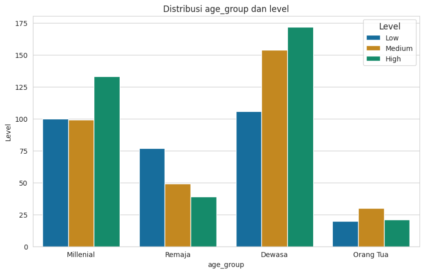
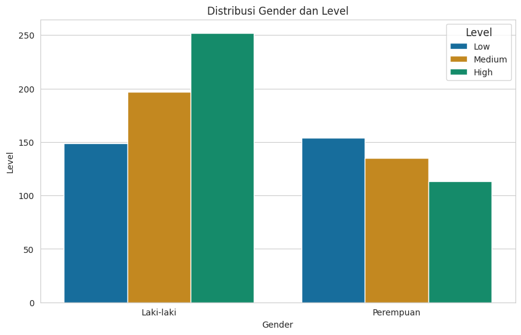
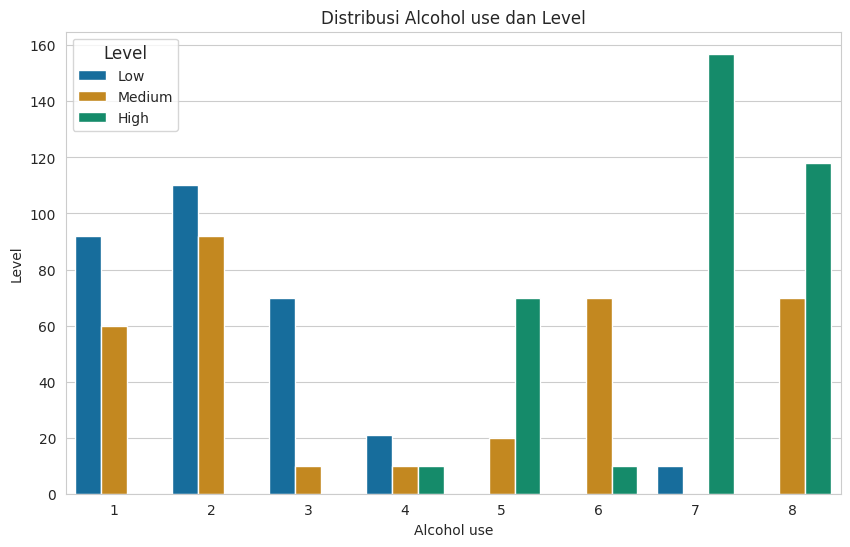

## Lung Cancer Prediction Model
### Background

- The motivation behind building a predictive model using lung cancer data is to support early detection, diagnosis, and effective treatment of lung cancer patients. Lung cancer is one of the deadliest diseases globally, and early detection is crucial for improving survival rates and patient outcomes.

### Objectives

The main objectives of this project are:

1. To identify the contributing factors behind different levels of lung cancer.
2. To develop a predictive model for detecting the level of lung cancer in patients based on selected features.

### EDA

The above column represents the percentage of lung inflammation cases based on their levels. It can be observed that cases with a high level have a percentage of 36.5%, for medium-level cases, there is a percentage of 33.2%, and for low-level cases, it is 30.3%.

Based on the visualization, it can be observed that patients with a "high" level of lung cancer are predominantly in the adult age category, followed by millennials, while the elderly age category has the fewest cases.
For patients with a "medium" level, they are also primarily in the adult age category, with the highest number of cases. Similarly, for cases with a "low" level, the majority fall in the adult age category.
This indicates that patients with lung cancer are predominantly in the adult age group, followed by millennials, teenagers, and the elderly, who have the fewest cases.

The above column indicates which gender of patients has the highest number of cases. Based on the visualization, for lung cancer cases with "high" and "medium" levels, they are predominantly observed in males, while for "low" level cases, females have a higher number of cases.

Here, I assume that the higher the number in "alcohol use," the more frequently the individual consumes alcohol. Based on the visualization, it can be observed that patients who consume alcohol very frequently tend to have a higher number of "high" level cases of lung cancer.

### Data and Features

This analysis utilizes a dataset containing various features that may influence the level of lung cancer. Some of these features include:

- 'Air Pollution'
- 'Alcohol use'
- 'Dust Allergy'
- 'Occupational Hazards'
- 'Genetic Risk'
- 'Chronic Lung Disease'
- 'Balanced Diet'
- 'Obesity'
- 'Smoking'
- 'Passive Smoker'
- 'Chest Pain'
- 'Coughing of Blood'
- 'Fatigue'
- 'Weight Loss'
- 'Shortness of Breath'
- 'Wheezing'
- 'Swallowing Difficulty'
- 'Clubbing of Finger Nails'
- 'Frequent Cold'
- 'Dry Cough'
- 'Snoring'

### Model Performance

Upon conducting the analysis, it was determined that predictive models using the Random Forest and Decision Tree algorithms exhibited the highest performance. Both models achieved an accuracy score of 0.95, signifying their effectiveness in detecting the level of lung cancer based on the chosen features.

### Model Usage

The predictive model created in this project can be utilized by hospitals and healthcare professionals for early detection of individuals at risk of lung cancer. By employing this model, they can expedite the diagnosis and treatment of potential cases, ultimately enhancing patient outcomes and survival rates.
